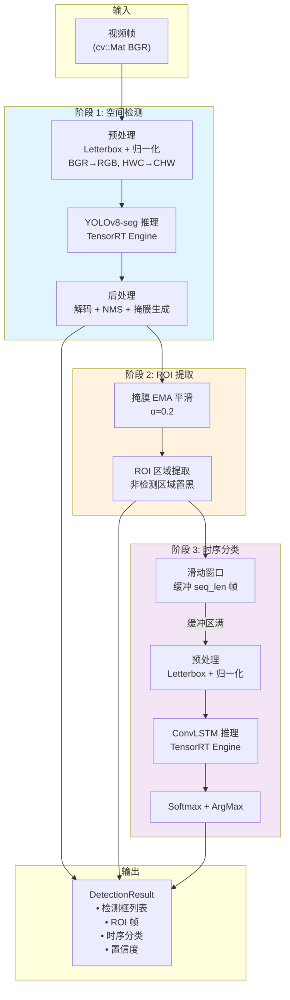
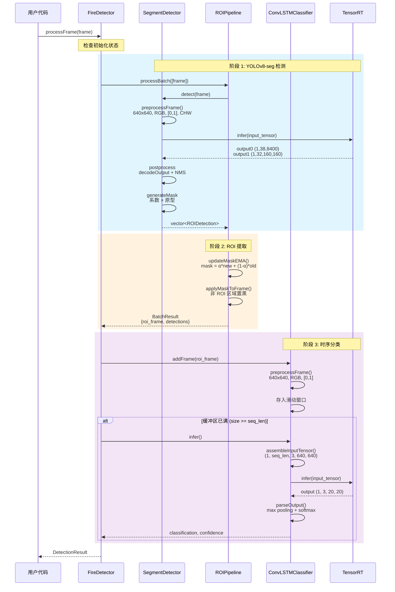
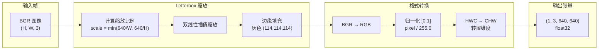
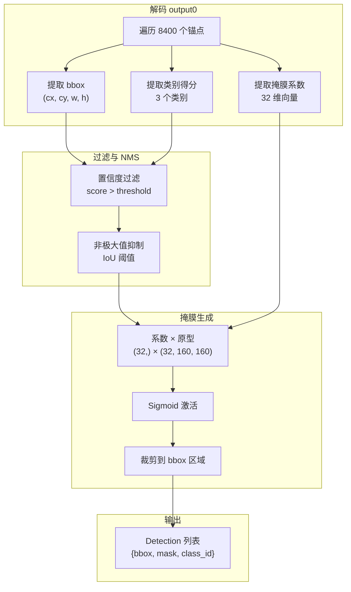
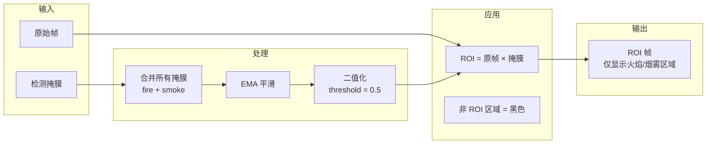
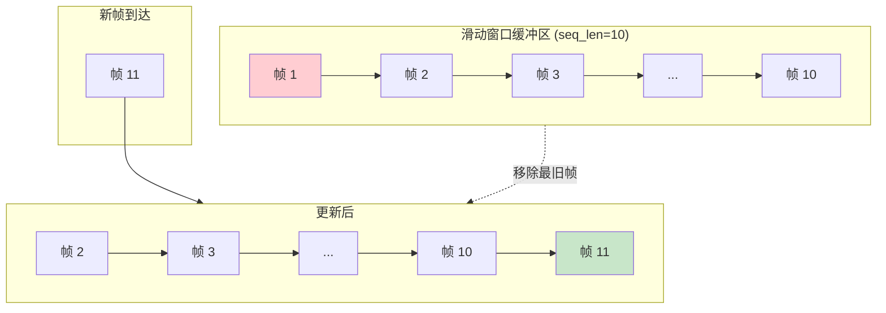
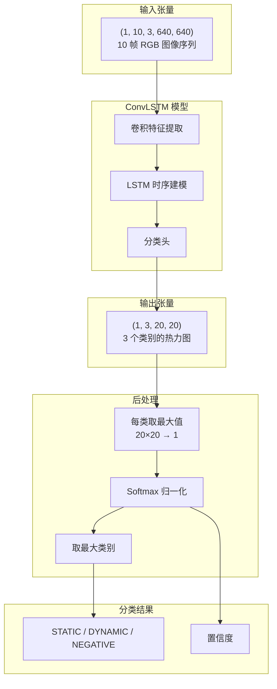
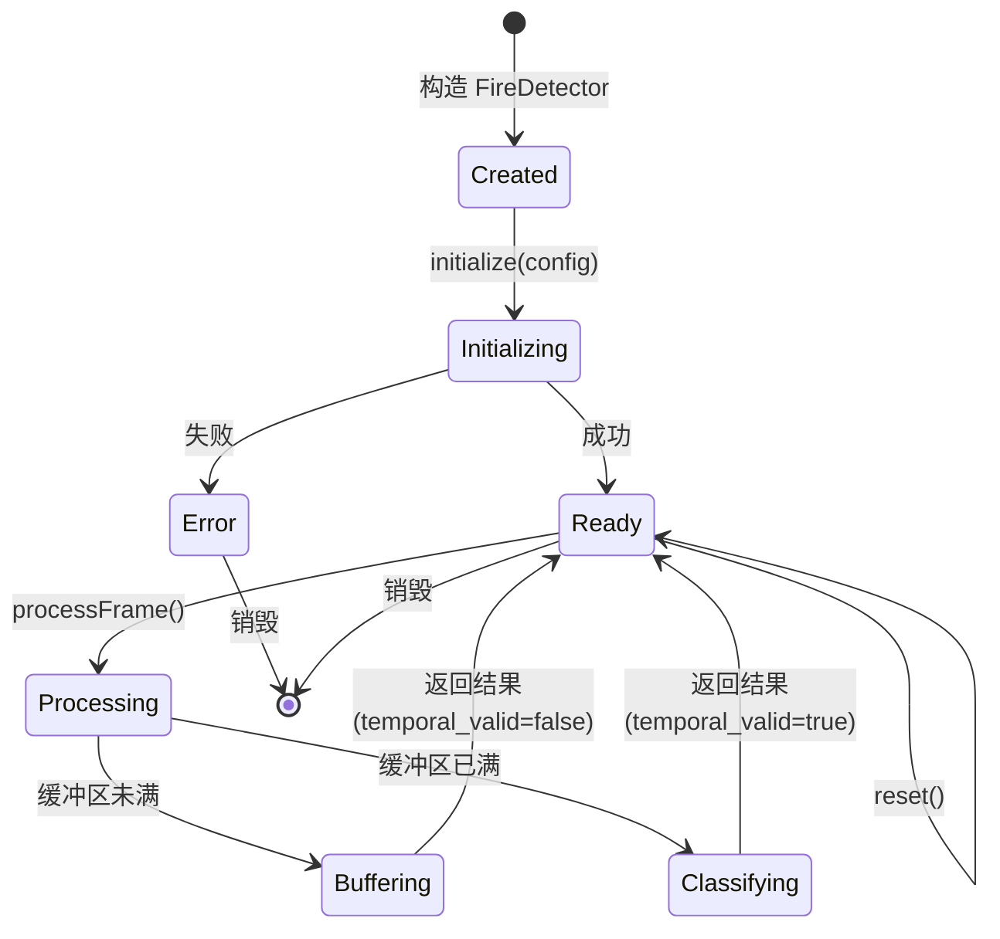

# Fire Detection API 技术架构文档

## 概述

Fire Detection API 是一个集成了深度学习的火灾检测库，提供从视频帧到火灾警报的完整处理流程。该库使用 YOLOv8-seg 进行实例分割检测，并通过 ConvLSTM 进行时序分析，以区分真实火灾与静态误报（如红色物体、灯光等）。

### 核心特性

- **双阶段检测**: YOLOv8-seg 空间检测 + ConvLSTM 时序分析
- **实时流式处理**: 单帧输入，内部自动管理滑动窗口
- **ROI 区域提取**: 仅关注火焰/烟雾区域，减少误报干扰
- **EMA 掩膜平滑**: 消除检测框抖动
- **双接口支持**: C++ 和 C 接口（便于 FFI 绑定）
- **PIMPL 模式**: ABI 稳定，实现细节隐藏

---

## 系统架构

### 模块层次结构

```
┌─────────────────────────────────────────────────────────────────┐
│                      Public API Layer                            │
│   fire_detection_api.h - C++/C 统一接口                         │
│   FireDetector 类 / fire_detector_* C 函数                       │
├─────────────────────────────────────────────────────────────────┤
│                    Implementation Layer                          │
│  ┌─────────────────┐  ┌─────────────────┐  ┌─────────────────┐  │
│  │ SegmentDetector │  │   ROIPipeline   │  │ConvLSTMClassifier│ │
│  │ (YOLOv8-seg)    │  │  (ROI 区域提取) │  │ (时序分类)       │ │
│  │ detector/       │  │  roi/           │  │ temporal/        │ │
│  └────────┬────────┘  └────────┬────────┘  └────────┬────────┘  │
│           │                    │                    │           │
├───────────┴────────────────────┴────────────────────┴───────────┤
│                     Foundation Layer                             │
│  ┌───────────────────┐  ┌──────────────────────────────────────┐│
│  │YOLOv8PostProcessor│  │       TrtEngineMultiTs (cudatt)      ││
│  │ (NMS + 掩膜生成)  │  │       TensorRT 推理引擎封装          ││
│  └───────────────────┘  └──────────────────────────────────────┘│
└─────────────────────────────────────────────────────────────────┘
```

### 目录结构

```
include/
├── fire_detection_api.h          # 公共 API（用户只需包含此文件）
├── detector/
│   ├── segment_detector.h        # YOLOv8-seg 检测器
│   └── yolov8_postprocess.h      # 后处理（NMS、掩膜）
├── roi/
│   └── roi_extractor.h           # ROI 区域提取与掩膜平滑
└── temporal/
    └── convlstm_classifier.h     # ConvLSTM 时序分类器

src/
├── api/
│   ├── fire_detection_api.cpp    # C++ API 实现（PIMPL）
│   └── fire_detection_api_c.cpp  # C 接口实现
├── detector/
│   ├── segment_detector.cpp
│   └── yolov8_postprocess.cpp
├── roi/
│   └── roi_extractor.cpp
├── temporal/
│   └── convlstm_classifier.cpp
└── demo/
    └── main.cpp                  # 示例程序
```

---

## 计算流程

### 整体数据流



### 详细计算流程



---

## 各阶段详解

### 阶段 1: YOLOv8-seg 空间检测

#### 输入预处理



#### YOLOv8-seg 输出解码

| 输出 | 形状 | 说明 |
|------|------|------|
| output0 | (1, 38, 8400) | 检测结果：4(bbox) + 3(类别) + 32(掩膜系数) × 8400 个锚点 |
| output1 | (1, 32, 160, 160) | 掩膜原型矩阵 |



### 阶段 2: ROI 区域提取

#### EMA 掩膜平滑

为了消除检测框的帧间抖动，使用指数移动平均（EMA）对掩膜进行时序平滑：

```
mask_ema = α × mask_new + (1 - α) × mask_old
```

默认 `α = 0.2`，表示新帧贡献 20%，历史帧贡献 80%。

#### ROI 帧生成



### 阶段 3: ConvLSTM 时序分类

#### 滑动窗口机制



#### ConvLSTM 推理流程



#### 分类类别说明

| 类别 | 枚举值 | 说明 | 颜色标记 |
|------|--------|------|----------|
| STATIC | 0 | 静态误报（图片、红色物体、灯光等） | 橙色 |
| DYNAMIC | 1 | 动态火焰（真实火灾，具有闪烁、扩散特征） | 红色 |
| NEGATIVE | 2 | 无检测（未检测到火焰/烟雾） | 绿色 |

---

## 数据结构

### 配置结构 (Config)

```cpp
struct Config {
    std::string yolo_engine_path;       // YOLOv8-seg 引擎路径（必需）
    std::string convlstm_engine_path;   // ConvLSTM 引擎路径（必需）
    float confidence_threshold = 0.5f;  // 检测置信度阈值
    float iou_threshold = 0.45f;        // NMS IoU 阈值
    int convlstm_seq_len = 10;          // 滑动窗口大小
    bool enable_roi_extraction = true;  // 启用 ROI 提取
    float ema_alpha = 0.2f;             // EMA 平滑系数
    float bbox_padding = 0.05f;         // 边界框填充比例
};
```

### 检测结果 (DetectionResult)

```cpp
struct DetectionResult {
    FrameResult frame;                  // 单帧检测结果
    bool temporal_valid = false;        // 时序结果是否有效
    TemporalClass temporal_class;       // STATIC / DYNAMIC / NEGATIVE
    float temporal_confidence;          // 时序分类置信度
    float class_scores[3];              // 各类别得分
};

struct FrameResult {
    bool has_fire;                      // 是否检测到火焰
    bool has_smoke;                     // 是否检测到烟雾
    std::vector<BoundingBox> detections; // 检测框列表
    cv::Mat roi_frame;                  // ROI 处理后的帧
};
```

---

## 性能参数

### 模型规格

| 模型 | 输入尺寸 | 输出尺寸 | 用途 |
|------|----------|----------|------|
| YOLOv8-seg | (1, 3, 640, 640) | (1, 38, 8400) + (1, 32, 160, 160) | 实例分割 |
| ConvLSTM | (1, 10, 3, 640, 640) | (1, 3, 20, 20) | 时序分类 |

### 检测类别

| 类别 ID | 名称 | 说明 |
|---------|------|------|
| 0 | FIRE | 火焰 |
| 1 | PERSON | 人（负样本，用于排除） |
| 2 | SMOKE | 烟雾 |

---

## 状态机



---

## 线程安全性

- **单实例单线程**: `FireDetector` 实例 **不是** 线程安全的
- **多实例**: 可以在不同线程中使用不同的 `FireDetector` 实例
- **GPU 资源**: TensorRT 上下文绑定到创建时的 CUDA 设备

推荐用法：

```cpp
// 正确：每个线程一个实例
void processThread(const std::string& video_path) {
    fire_detection::FireDetector detector;
    detector.initialize(config);
    // ... 处理视频
}

// 错误：多线程共享实例
fire_detection::FireDetector shared_detector;  // 危险！
```

---

## 参考资料

- [YOLOv8 文档](https://docs.ultralytics.com/)
- [TensorRT 开发者指南](https://docs.nvidia.com/deeplearning/tensorrt/)
- [ConvLSTM 论文](https://arxiv.org/abs/1506.04214)
