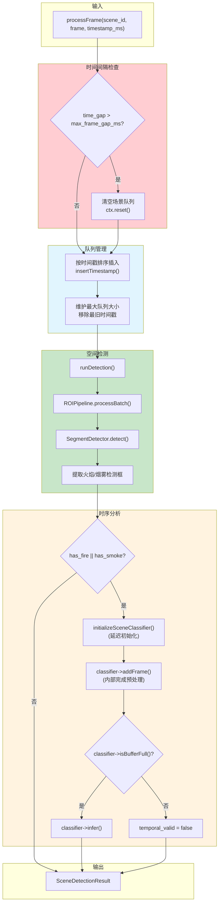
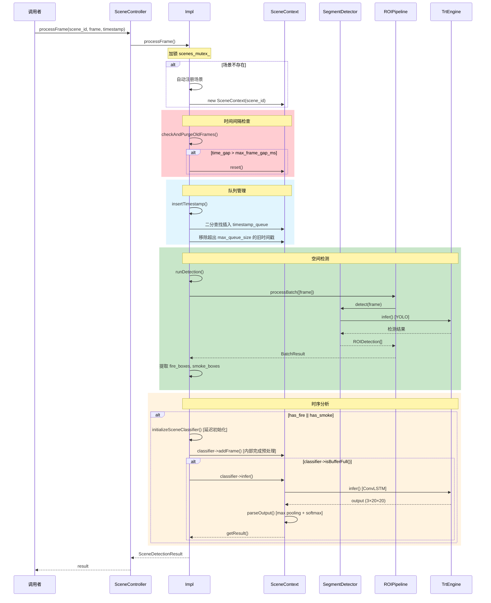

# SceneController 场景控制器技术手册

## 概述

SceneController 是专为球形摄像机（PTZ）设计的多场景火灾检测控制器。它解决了球形摄像机周期性旋转切换不同场景时，传统单一检测器无法正确维护时序状态的问题。

### 核心特性

- **多场景独立管理**: 每个场景维护独立的帧队列和 ConvLSTM 缓冲区
- **自动场景注册**: 首次处理帧时自动注册场景
- **时间间隔检查**: 场景切换时自动清空过期帧队列
- **乱序帧处理**: 按时间戳排序插入，支持网络延迟导致的乱序
- **线程安全**: 内部使用互斥锁保护场景映射表
- **共享推理引擎**: 所有场景共用 YOLO 和 ConvLSTM 引擎，节省显存

---

## 系统架构

### 组件层次结构

```
┌─────────────────────────────────────────────────────────────────────┐
│                      SceneController (公共接口)                       │
│   - registerScene() / unregisterScene()                              │
│   - processFrame() / processFrameRaw()                               │
│   - resetScene() / resetAllScenes()                                  │
├─────────────────────────────────────────────────────────────────────┤
│                      SceneController::Impl (PIMPL)                   │
│                                                                      │
│  ┌──────────────────────────────────────────────────────────────┐   │
│  │              共享推理组件 (所有场景共用)                        │   │
│  │  ┌─────────────────┐  ┌─────────────────┐                    │   │
│  │  │ TrtEngineMultiTs│  │ TrtEngineMultiTs│                    │   │
│  │  │ (YOLO Engine)   │  │ (ConvLSTM Engine)│                   │   │
│  │  └────────┬────────┘  └────────┬────────┘                    │   │
│  │           │                    │                              │   │
│  │  ┌────────┴────────┐  ┌────────┴────────┐                    │   │
│  │  │ SegmentDetector │  │ConvLSTMClassifier│                   │   │
│  │  └────────┬────────┘  └────────┬─────────┘                   │   │
│  │           │                    │                              │   │
│  │  ┌────────┴────────┐          │                              │   │
│  │  │   ROIPipeline   │          │                              │   │
│  │  └─────────────────┘          │                              │   │
│  └───────────────────────────────┴──────────────────────────────┘   │
│                                                                      │
│  ┌──────────────────────────────────────────────────────────────┐   │
│  │            场景映射表 scenes_ (独立状态)                        │   │
│  │  ┌──────────────┐  ┌──────────────┐  ┌──────────────┐        │   │
│  │  │ SceneContext │  │ SceneContext │  │ SceneContext │ ...    │   │
│  │  │ scene_id=1   │  │ scene_id=2   │  │ scene_id=3   │        │   │
│  │  ├──────────────┤  ├──────────────┤  ├──────────────┤        │   │
│  │  │timestamp_que │  │timestamp_que │  │timestamp_que │        │   │
│  │  │classifier    │  │classifier    │  │classifier    │        │   │
│  │  │last_timestamp│  │last_timestamp│  │last_timestamp│        │   │
│  │  │last_roi_frame│  │last_roi_frame│  │last_roi_frame│        │   │
│  │  └──────────────┘  └──────────────┘  └──────────────┘        │   │
│  └──────────────────────────────────────────────────────────────┘   │
└─────────────────────────────────────────────────────────────────────┘
```

### SceneContext 结构

每个场景维护独立的上下文数据：

| 字段 | 类型 | 说明 |
|------|------|------|
| `scene_id` | `int32_t` | 场景唯一标识 |
| `timestamp_queue` | `deque<int64_t>` | 按时间排序的时间戳队列（用于时间间隔检查） |
| `classifier` | `unique_ptr<ConvLSTMClassifier>` | 独立的 ConvLSTM 分类器实例（内部管理帧缓冲区和推理） |
| `last_processed_timestamp` | `int64_t` | 最后处理的时间戳 |
| `last_roi_frame` | `cv::Mat` | 最后的 ROI 提取帧 |

> **注意**:
> - 时间戳队列仅存储时间戳（8字节），不存储原始帧数据，大幅降低内存占用。
> - `classifier` 采用延迟初始化，仅在检测到火焰/烟雾时才创建，节省资源。

---

## 核心处理流程

### 整体调用流程



### 时序调用图



---

## 关键实现逻辑

### 1. 时间间隔检查 (`checkAndPurgeOldFrames`)

**目的**: 当球机切换场景后重新回到某个场景时，如果间隔时间过长，之前缓存的帧已经过时，需要清空重新开始。

**实现逻辑**:

```cpp
void checkAndPurgeOldFrames(SceneContext& ctx, int64_t current_timestamp) {
    if (ctx.timestamp_queue.empty()) return;

    // 获取队列中最新的时间戳
    int64_t newest_in_queue = ctx.timestamp_queue.back();

    // 计算时间差（绝对值，支持乱序）
    int64_t time_gap = std::abs(current_timestamp - newest_in_queue);

    if (time_gap > config_.max_frame_gap_ms) {
        // 时间间隔过大，清空整个队列
        ctx.reset();
    }
}
```

**配置参数**: `max_frame_gap_ms` (默认 30000ms = 30秒)

### 2. 排序插入 (`insertTimestamp`)

**目的**: 处理网络延迟导致的帧乱序问题，确保时间戳队列有序。

**实现逻辑**:

```cpp
void insertTimestamp(SceneContext& ctx, int64_t timestamp_ms) {
    // 二分查找插入位置
    auto it = std::lower_bound(
        ctx.timestamp_queue.begin(),
        ctx.timestamp_queue.end(),
        timestamp_ms
    );

    // 时间戳重复则忽略
    if (it != ctx.timestamp_queue.end() && *it == timestamp_ms) {
        return;
    }

    // 插入新时间戳
    ctx.timestamp_queue.insert(it, timestamp_ms);

    // 维护队列最大大小
    while (ctx.timestamp_queue.size() > config_.max_queue_size) {
        ctx.timestamp_queue.pop_front();  // 移除最旧的时间戳
    }
}
```

**配置参数**: `max_queue_size` (默认 30)

> **优化说明**: 时间戳队列仅存储 `int64_t`（8字节），相比原设计存储完整帧数据，内存占用减少约 99.99%。

### 3. 空间检测 (`runDetection`)

**目的**: 使用 YOLOv8-seg 检测火焰和烟雾，并提取 ROI 区域。

**处理流程**:

1. 调用 `ROIPipeline.processBatch()` 进行批量处理
2. ROIPipeline 内部调用 `SegmentDetector.detect()` 执行 YOLO 推理
3. 应用 EMA 掩膜平滑，提取 ROI 区域
4. 坐标缩放（从 640×640 映射回原图尺寸）
5. 分离火焰和烟雾检测框

**坐标缩放公式**:

```cpp
const float scale_x = static_cast<float>(frame.cols) / 640.0f;
const float scale_y = static_cast<float>(frame.rows) / 640.0f;

bbox.x1 = det.bbox.x * scale_x;
bbox.y1 = det.bbox.y * scale_y;
bbox.x2 = (det.bbox.x + det.bbox.width) * scale_x;
bbox.y2 = (det.bbox.y + det.bbox.height) * scale_y;
```

### 4. 分类器延迟初始化 (`initializeSceneClassifier`)

**目的**: 仅在需要时（检测到火焰/烟雾）为场景创建 ConvLSTM 分类器实例，节省资源。

**实现逻辑**:

```cpp
bool initializeSceneClassifier(SceneContext& ctx) {
    if (ctx.classifier) {
        return true;  // 已经初始化
    }

    int seq_len = config_.detector_config.convlstm_seq_len;
    ctx.classifier = std::make_unique<convlstm::ConvLSTMClassifier>(
        *convlstm_engine_, seq_len
    );

    if (!ctx.classifier->initialize()) {
        std::cerr << "Failed to initialize classifier for scene "
                  << ctx.scene_id << std::endl;
        ctx.classifier.reset();
        return false;
    }

    return true;
}
```

### 5. 时序分析 (ConvLSTMClassifier)

**目的**: 使用 ConvLSTM 对时序帧序列进行分类，区分真实火灾与静态误报。

SceneController 复用 `ConvLSTMClassifier` 类（定义于 `temporal/convlstm_classifier.h`），该类封装了：
- 帧预处理（Resize 640x640 + BGR→RGB + 归一化到 [0,1]）
- 滑动窗口帧缓冲区管理
- GPU Tensor 内存管理
- TensorRT 推理和输出解析

**使用流程**:

```cpp
// 检测到火焰/烟雾时
if (result.has_fire || result.has_smoke) {
    // 1. 延迟初始化分类器
    if (!ctx.classifier && !initializeSceneClassifier(ctx)) {
        return result;
    }

    // 2. 添加帧到缓冲区（内部完成预处理）
    ctx.classifier->addFrame(processed_frame);

    // 3. 缓冲区满后执行推理
    if (ctx.classifier->isBufferFull()) {
        if (ctx.classifier->infer()) {
            const auto& cls_result = ctx.classifier->getResult();
            result.temporal_valid = true;
            result.temporal_class = static_cast<TemporalClass>(
                static_cast<int>(cls_result.classification)
            );
            result.temporal_confidence = cls_result.confidence;
            result.is_fire_confirmed =
                (cls_result.classification == convlstm::Classification::DYNAMIC);
        }
    }
}
```

**输入输出格式**:

| 项目 | 格式 |
|------|------|
| 输入 | `(1, seq_len, 3, 640, 640)` - NCTHW |
| 输出 | `(1, 3, 20, 20)` - 每个类别的热力图 |

**分类类别**:

| 类别 | 枚举值 | 说明 |
|------|--------|------|
| STATIC | 0 | 静态误报（红色物体、灯光等） |
| DYNAMIC | 1 | 动态火焰（真实火灾） |
| NEGATIVE | 2 | 无火焰 |

**火灾确认逻辑**:

```cpp
result.is_fire_confirmed = (classification == Classification::DYNAMIC);
```

---

## 配置参数说明

### SceneConfig

```cpp
struct SceneConfig {
    Config detector_config;           // 基础检测器配置

    int64_t max_frame_gap_ms = 30000; // 帧间最大时间间隔（毫秒）
                                      // 超过此值清空队列

    int64_t min_sample_interval_ms = 100;  // 最小采样间隔（预留）

    int max_queue_size = 30;          // 每个场景最大队列帧数
};
```

### Config (detector_config)

```cpp
struct Config {
    std::string yolo_engine_path;      // YOLOv8-seg TensorRT 引擎路径
    std::string convlstm_engine_path;  // ConvLSTM TensorRT 引擎路径

    float confidence_threshold = 0.3f; // 检测置信度阈值
    float iou_threshold = 0.45f;       // NMS IoU 阈值

    bool enable_roi_extraction = true; // 是否启用 ROI 提取
    float ema_alpha = 0.2f;           // EMA 平滑系数
    int bbox_padding = 10;            // 检测框填充像素

    int convlstm_seq_len = 16;        // ConvLSTM 序列长度
};
```

---

## 使用示例

### C++ 接口

```cpp
#include "scene/scene_controller.h"

// 配置
fire_detection::SceneConfig config;
config.detector_config.yolo_engine_path = "models/segment.engine";
config.detector_config.convlstm_engine_path = "models/convlstm.engine";
config.detector_config.confidence_threshold = 0.3f;
config.max_frame_gap_ms = 30000;  // 30秒

// 初始化
fire_detection::SceneController controller;
if (!controller.initialize(config)) {
    std::cerr << "初始化失败" << std::endl;
    return 1;
}

// 可选：预注册场景
controller.registerScene(1);
controller.registerScene(2);

// 处理帧
while (true) {
    int scene_id = getCurrentSceneId();  // 获取当前场景ID
    cv::Mat frame = captureFrame();      // 获取帧
    int64_t timestamp = getCurrentTimeMs();

    auto result = controller.processFrame(scene_id, frame, timestamp);

    // 检查结果
    if (result.has_fire || result.has_smoke) {
        std::cout << "检测到疑似火焰/烟雾" << std::endl;

        if (result.temporal_valid && result.is_fire_confirmed) {
            std::cout << ">>> 火灾警报! 置信度: "
                      << result.temporal_confidence << std::endl;
        }
    }

    // 使用便捷方法
    if (result.isFireAlert()) {
        triggerAlarm(scene_id);
    }
}
```

### C 接口

```c
#include "scene/scene_controller.h"

// 创建并初始化
SceneControllerHandle handle = scene_controller_create();

SceneControllerConfig config = {0};
strcpy(config.detector_config.yolo_engine_path, "models/segment.engine");
strcpy(config.detector_config.convlstm_engine_path, "models/convlstm.engine");
config.detector_config.confidence_threshold = 0.3f;
config.max_frame_gap_ms = 30000;

if (!scene_controller_initialize(handle, &config)) {
    printf("初始化失败\n");
    return 1;
}

// 处理帧
SceneDetectionResultC result;
scene_controller_process_frame(
    handle,
    scene_id,
    frame_data, width, height, 3,
    timestamp_ms,
    &result
);

if (result.is_fire_confirmed) {
    printf("场景 %d 火灾警报!\n", result.scene_id);
}

// 清理
scene_controller_destroy(handle);
```

---

## 线程安全说明

SceneController 内部使用 `std::mutex` 保护场景映射表：

- 所有场景管理操作（注册/删除/查询）都是线程安全的
- `processFrame()` 会锁定整个处理过程
- 不同场景的帧处理**不能**并行（因为共享推理引擎）

**推荐使用模式**:

```cpp
// 单线程处理
while (running) {
    auto result = controller.processFrame(scene_id, frame, timestamp);
    // ...
}

// 或者使用队列 + 单处理线程
std::queue<FrameTask> task_queue;
std::thread processor([&]() {
    while (running) {
        auto task = task_queue.pop();
        auto result = controller.processFrame(
            task.scene_id, task.frame, task.timestamp);
        // ...
    }
});
```

---

## 性能考虑

1. **显存使用**: 所有场景共享 YOLO 和 ConvLSTM TensorRT 引擎，显存占用固定
2. **CPU 内存**:
   - 时间戳队列：每场景约 `max_queue_size × 8 bytes`（极低）
   - ConvLSTMClassifier：每场景约 `seq_len × 640 × 640 × 3 × 4 bytes`（约 75MB，seq_len=16）
   - 采用延迟初始化，未检测到目标的场景不分配 classifier 内存
3. **GPU 内存**:
   - 每个 ConvLSTMClassifier 实例维护独立的输入/输出 Tensor（约 150MB/场景）
   - 分类器仅在检测到火焰/烟雾时才创建
4. **推理延迟**: 每帧需要 YOLO + ConvLSTM 两次推理（如果检测到目标）
5. **队列大小**: `max_queue_size` 仅影响时间戳存储，内存影响可忽略

---

## 错误处理

| 情况 | 行为 |
|------|------|
| 未初始化调用 `processFrame()` | 返回空结果，打印错误日志 |
| 空帧输入 | 返回空结果，打印错误日志 |
| 场景不存在 | 自动注册新场景 |
| Classifier 初始化失败 | 返回空间检测结果，`temporal_valid = false`，打印错误日志 |
| ConvLSTM 缓冲区未满 | `temporal_valid = false` |
| 推理失败 | `temporal_valid = false`，打印错误日志 |
