# main.cpp 火灾检测流水线实现说明

## 概述

本程序实现了一个基于 YOLOv8-seg 的火灾/烟雾检测流水线，包含两个核心功能：

1. **画面分割 (ROI 提取)** — 通过实例分割模型识别视频帧中的火焰和烟雾区域，将非目标区域遮罩为黑色
2. **时序分类 (ConvLSTM)** — 对连续帧序列进行时序分析，区分动态火焰、静态误报和无检测状态

---

## 整体架构流程图

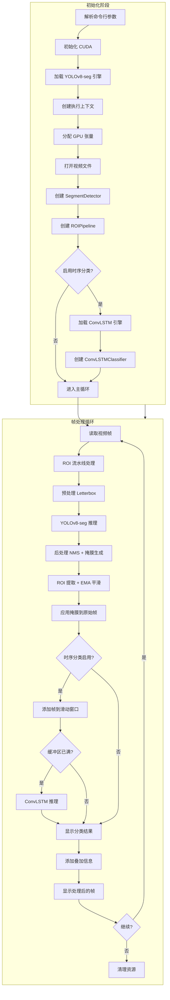

---

## 命令行参数

```bash
Usage: fire_detection_test --video <path> --engine <path> [options]

Required arguments:
  --video PATH        输入视频文件路径
  --engine PATH       YOLOv8-seg TensorRT 引擎路径

Options:
  --confidence FLOAT  检测置信度阈值 (默认: 0.5)
  --iou FLOAT         NMS IoU 阈值 (默认: 0.45)
  --no-display        禁用显示 (无头模式)
  --help              显示帮助信息

Temporal Classification (ConvLSTM):
  --convlstm-engine PATH  ConvLSTM 引擎路径 (启用时序分类)
  --seq-len INT           ConvLSTM 序列长度 (默认: 10)
```

---

## 核心组件详解

### 1. 预处理流程 (`preprocessFrame`)

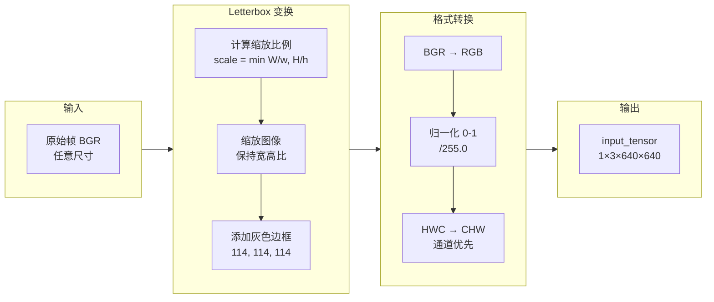

**关键参数:**
- 目标尺寸: 640 × 640
- Letterbox 填充颜色: (114, 114, 114) 灰色
- 返回值: `(scale, pad_x, pad_y)` 用于后续坐标还原

**代码位置:** [main.cpp:182-230](src/main.cpp#L182-L230)

### 2. YOLOv8-seg 推理流程

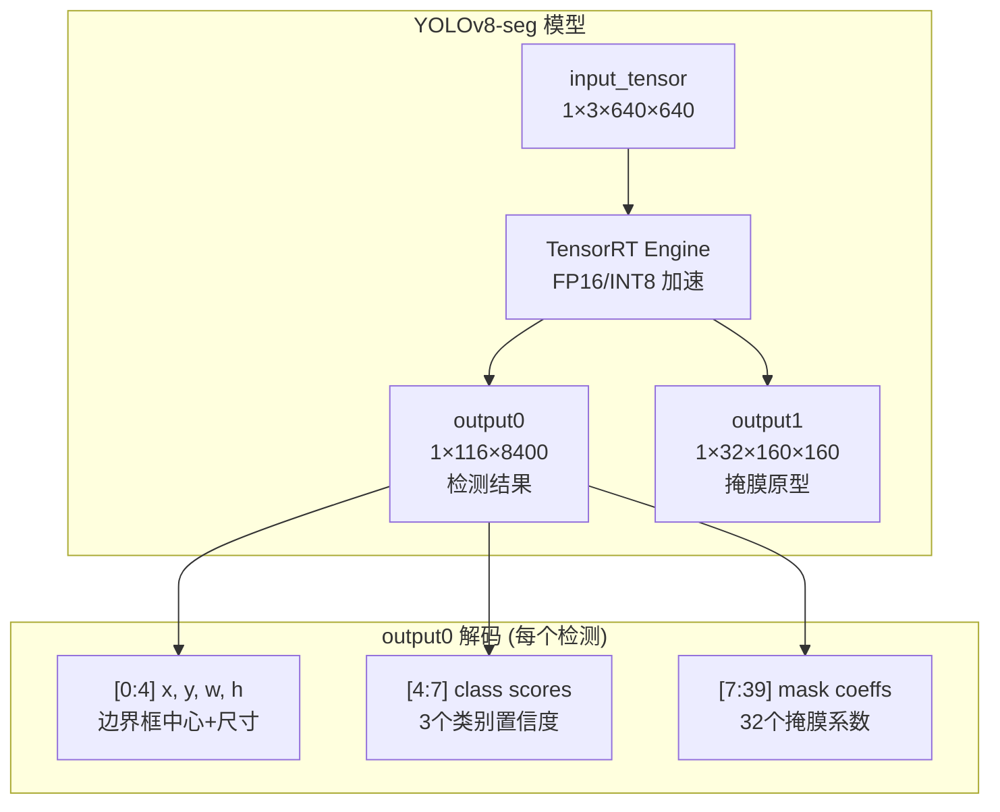

**输出张量说明:**

| 输出 | 形状 | 说明 |
|------|------|------|
| output0 | (1, 116, 8400) | 8400 个候选框，每个 116 维 = 4(bbox) + 3(类别) + 32(掩膜系数) + 77(保留) |
| output1 | (1, 32, 160, 160) | 32 个 160×160 的掩膜原型基 |

**代码位置:** [main.cpp:364-383](src/main.cpp#L364-L383)

### 3. 后处理流程 (`YOLOv8PostProcessor`)

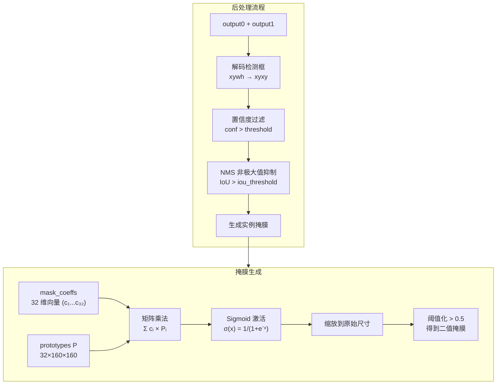

**掩膜生成公式:**
```
mask_160x160 = sigmoid(Σᵢ mask_coeffsᵢ × prototypesᵢ)
mask_binary = resize(mask_160x160, original_size) > 0.5
```

**代码位置:** [yolov8_postprocess.cpp](src/yolov8_postprocess.cpp)

### 4. SegmentDetector 检测器类

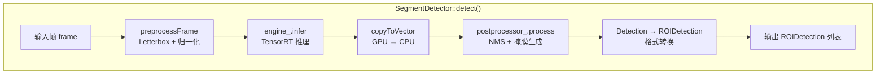

**代码位置:** [main.cpp:235-305](src/main.cpp#L235-L305)

### 5. ROI 提取流水线 (`ROIPipeline`)

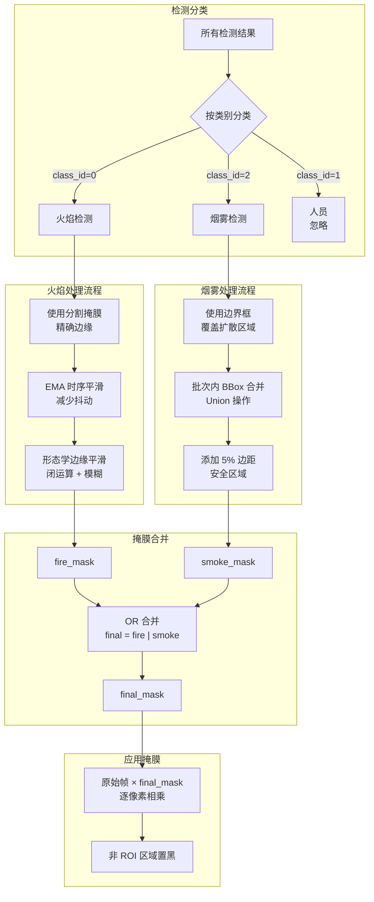

**处理策略差异:**

| 类别 | class_id | 策略 | 原因 |
|------|----------|------|------|
| 火焰 | 0 | 分割掩膜 + EMA 平滑 | 火焰边缘不规则，需要精确分割和时序稳定 |
| 烟雾 | 2 | 边界框合并 | 烟雾扩散范围大，边界模糊，bbox 更稳定 |
| 人员 | 1 | 忽略 | 负样本类，不参与 ROI 提取 |

**代码位置:** [roi_extractor.cpp](src/roi_extractor.cpp)

### 6. EMA 掩膜平滑 (`MaskEMA`)

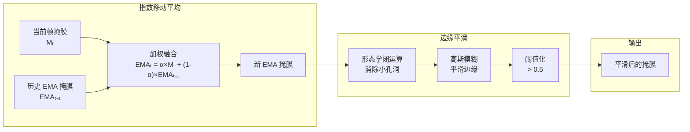

**EMA 公式:**
```
EMA_mask_t = α × current_mask_t + (1-α) × EMA_mask_(t-1)
```

**参数影响:**
- α = 0.2 (默认值)
- 较小的 α → 更平滑，但延迟更大
- 较大的 α → 响应更快，但抖动更多

**代码位置:** [roi_extractor.h](include/roi_extractor.h) MaskEMA 类

---

## ConvLSTM 时序分类

### 7. ConvLSTM 分类器 (`ConvLSTMClassifier`)

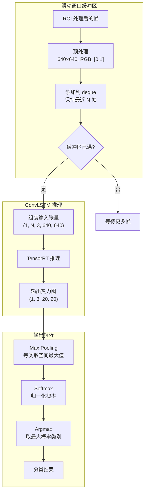

**分类类别:**

| 类别 | 枚举值 | 说明 | 显示颜色 |
|------|--------|------|----------|
| STATIC | 0 | 静态火焰/误报（如红色物体、灯光） | 橙色 |
| DYNAMIC | 1 | 动态火焰（真实火灾，具有闪烁、扩散特征） | 红色 |
| NEGATIVE | 2 | 无检测（无火焰/烟雾） | 绿色 |

**模型输入输出:**
- 输入: `(1, seq_len, 3, 640, 640)` — seq_len 帧 RGB 图像序列
- 输出: `(1, 3, 20, 20)` — 3 个类别的 20×20 热力图

**代码位置:** [convlstm_classifier.cpp](src/convlstm_classifier.cpp)

### 8. ConvLSTM 预处理流程

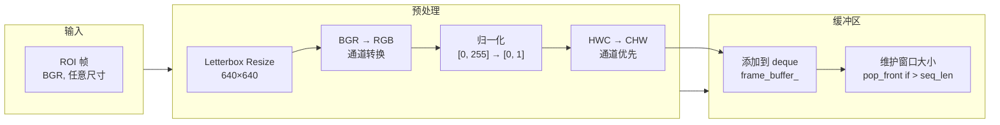

**代码位置:** [convlstm_classifier.cpp:72-117](src/convlstm_classifier.cpp#L72-L117)

---

## 完整数据流向图

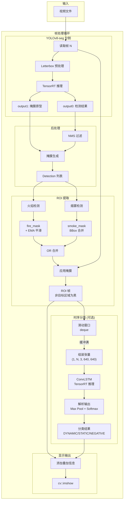

---

## 关键常量配置

```cpp
// ===== YOLOv8-seg 模型常量 =====
constexpr int INPUT_WIDTH = 640;          // 模型输入宽度
constexpr int INPUT_HEIGHT = 640;         // 模型输入高度
constexpr int NUM_CLASSES = 3;            // 类别数: 火焰(0)、人员(1)、烟雾(2)
constexpr int MASK_PROTO_H = 160;         // 掩膜原型高度
constexpr int MASK_PROTO_W = 160;         // 掩膜原型宽度
constexpr int NUM_MASK_COEFFS = 32;       // 掩膜系数数量

// ===== ROI 提取参数 =====
constexpr float EMA_ALPHA = 0.2f;         // EMA 平滑因子
constexpr float BBOX_PADDING_RATIO = 0.05f; // 烟雾 bbox 边距 (5%)
constexpr float DEFAULT_CONF_THRESHOLD = 0.5f;  // 默认置信度阈值
constexpr float DEFAULT_IOU_THRESHOLD = 0.45f;  // 默认 NMS IoU 阈值

// ===== ConvLSTM 模型常量 =====
constexpr int CONVLSTM_INPUT_WIDTH = 640;   // ConvLSTM 输入宽度
constexpr int CONVLSTM_INPUT_HEIGHT = 640;  // ConvLSTM 输入高度
constexpr int CONVLSTM_NUM_CLASSES = 3;     // 分类数: STATIC(0), DYNAMIC(1), NEGATIVE(2)
constexpr int CONVLSTM_HEATMAP_SIZE = 20;   // 输出热力图尺寸
constexpr int DEFAULT_SEQ_LEN = 10;         // 默认序列长度
```

---

## 类图

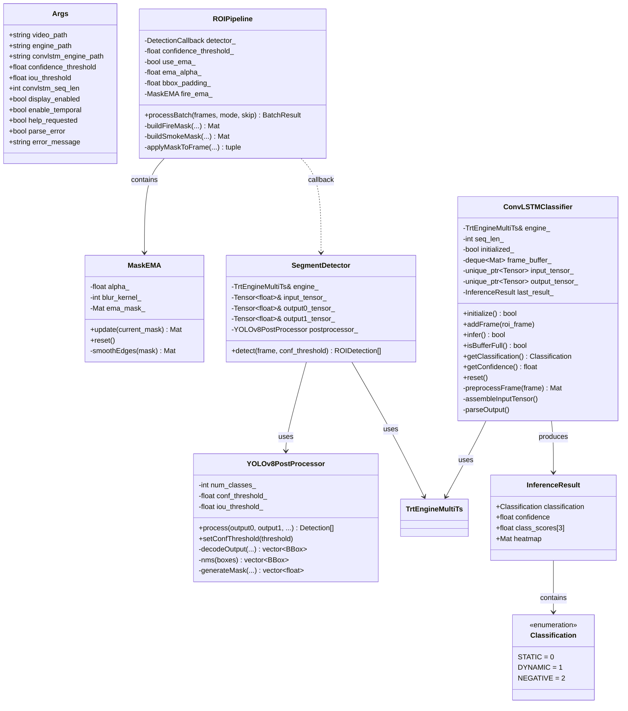

---

## 处理时序图

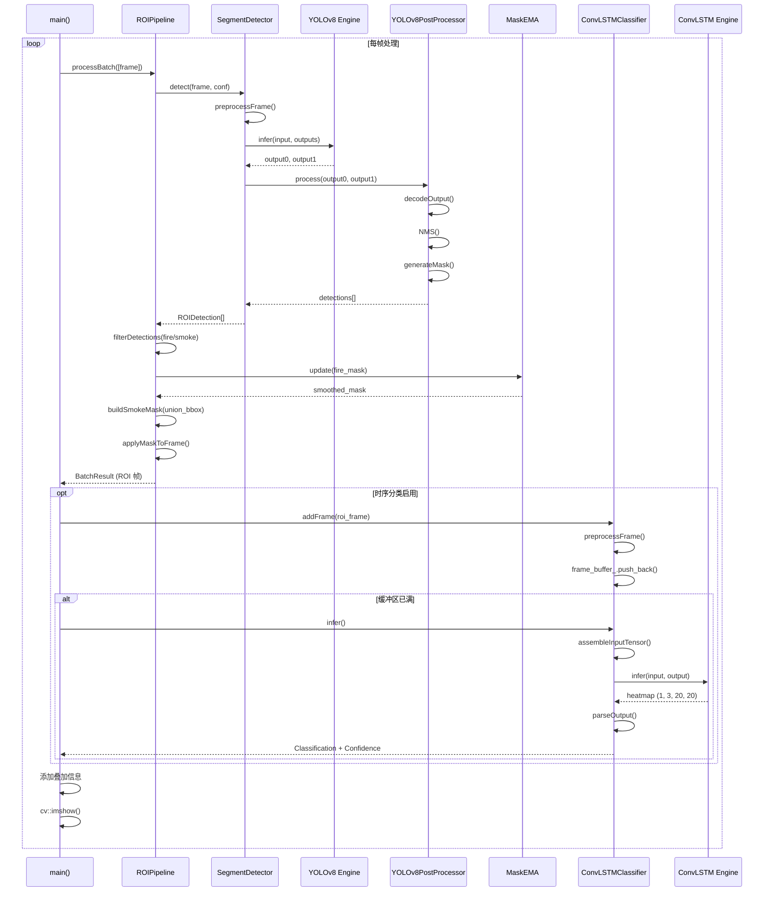

---

## 显示叠加信息

程序在输出帧上显示以下信息：

| 位置 | 内容 | 说明 |
|------|------|------|
| (10, 30) | `Frame: N/Total` | 当前帧/总帧数 |
| (10, 60) | `Inference: X ms` | 单帧推理耗时 |
| (10, 90) | `Status: FIRE/SMOKE/No detection` | 检测状态 |
| (10, 120) | `Buffer: N/SeqLen` | ConvLSTM 缓冲区状态 (仅时序分类启用时) |
| (10, 150) | `Temporal: DYNAMIC/STATIC/NEGATIVE (XX%)` | 时序分类结果 (仅时序分类启用时) |
| (center, 50) | `!!! FIRE ALERT !!!` | 动态火焰警告 (红色) |

---

## 键盘控制

| 按键 | 功能 |
|------|------|
| `q` / `ESC` | 退出程序 |
| `p` | 暂停/继续播放 |
| `Space` | 暂停时单步前进一帧 |

---

## 总结

main.cpp 的火灾检测流水线采用了以下技术栈：

1. **深度学习推理**: TensorRT 加速的 YOLOv8-seg 和 ConvLSTM 模型
2. **实例分割**: 基于 32 维掩膜系数和 160×160 原型的掩膜生成
3. **时序平滑**: EMA 指数移动平均减少掩膜抖动
4. **差异化处理**: 火焰用精确分割 + EMA，烟雾用边界框合并
5. **时序分类**: ConvLSTM 滑动窗口推理，区分动态/静态/无检测
6. **实时可视化**: OpenCV 窗口显示处理结果和分类状态

整个流水线实现了从视频输入到 ROI 提取 + 时序分类输出的端到端处理，适用于实时火灾检测和误报过滤场景。
